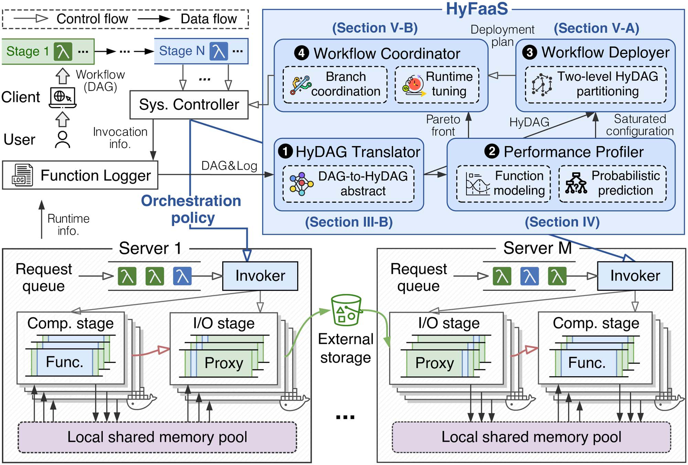

# HyFaaS: Accelerating Serverless Workflows by Unleashing Hybrid Resource Elasticity

This repository contains the source code for the paper:

> - [HyFaaS: Accelerating Serverless Workflows by Unleashing Hybrid Resource Elasticity](https://doi.org/10.1109/TPDS.2025.3632089)

## Overview

<p align="center">
  
</p>

HyFaaS separates computation and communication in serverless workflows. It rewrites a workflow DAG into a HyDAG with explicit compute and I/O stages, profiles stage-level resource configurations, searches an LHP-style deployment plan, and coordinates non-critical branches to reduce cost while preserving workflow latency.

---

## Requirements

- JDK 11 or JDK 17
- Docker 20+
- Python 3.8+
- Node.js/npm for OpenWhisk standalone packaging
- Standard OpenWhisk deployment dependencies for cluster mode

The Gradle build already prefers Aliyun Maven repositories through `settings.gradle` and `build.gradle`.

---

## Build

Compile the modified modules:

```bash
./gradlew :common:scala:compileScala
./gradlew :core:controller:compileScala
./gradlew :core:invoker:compileScala
```
---

## Deploy

Start standalone OpenWhisk:

```bash
./gradlew :core:standalone:bootJar
java -jar bin/openwhisk-standalone.jar --no-ui --dev-mode
```

HyFaaS uses these invoker-side paths:

```bash
export HYFAAS_SHARED_MEMORY=/mnt/hyfaas
export HYFAAS_OBJECT_STORE=/mnt/hyfaas-object-store
```

Deployment snippets:

- Docker Compose: `tools/hyfaas/deploy/docker-compose.override.yml`
- Kubernetes: `tools/hyfaas/deploy/kubernetes-invoker-patch.yaml`

---

## Register Actions

Register the HyFaaS proxy and benchmark actions:

```bash
bash tools/hyfaas/bin/register-actions.sh
```

Registered actions:

```text
hyfaas/proxy
hyfaas/word_count
hyfaas/terapipeline
hyfaas/ml_pipeline
hyfaas/sort_pipeline
hyfaas/video_pipeline
hyfaas/slapp_pipeline
```

---

## Runtime Helper

Python actions can use `tools/hyfaas/runtime/hyfaas_memory.py`:

```python
from hyfaas_memory import read, write

def main(args):
    context = args.get("hyfaas")
    payload = read(context=context)
    result = payload.upper()
    write(result, context=context)
    return {"bytes": len(result)}
```
---

## Reference

- [Apache OpenWhisk](https://github.com/apache/openwhisk)
- [Sonic: Application-aware Data Passing for Chained Serverless Applications](https://www.usenix.org/conference/atc21/presentation/mahgoub)
- [DataFlower: Exploiting the Data-Flow Paradigm for Serverless Computing](https://dl.acm.org/doi/10.1145/3373376.3378517)
- [Ditto: Efficient Serverless Analytics with Elastic Parallelism](https://dl.acm.org/doi/10.1145/3477132.3483541)
